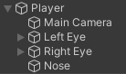

Go to the **Hierarchy** window and make sure your Main Camera is positioned as a child of your player.

If your camera is following your player but not at the angle you want then you can look at the **Transform** component in the Main Camera's Inspection and update the `x`, `y`, or `z` position until you find an angle you are happy with. 
